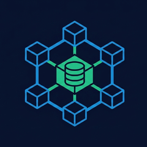

  

<h1 align="center">kagmus</h1>

  <strong>Kernel-enforced safety for AI agents. Your agent thinks it has root; it doesn't.</strong>

  <a href="https://kagmus.dev">kagmus.dev</a> &nbsp;&middot;&nbsp;
  <a href="https://kagmus.dev/#demo">Watch it run</a> &nbsp;&middot;&nbsp;
  <a href="https://kagmus.dev/#pricing">Pricing</a>

  
   
  <em>A rogue agent runs <code>rm -rf</code> inside its branch and exits 0. The base is byte-identical, an attempt to escape the branch is denied, and the deletions are staged on the branch for review, never on your base.</em>

---

kagmus is a kernel-enforced runtime for AI agents. An agent runs inside it and believes it has a normal machine: it can run `rm -rf` and get exit 0. Nothing is deleted. The base is byte-identical, because every write landed on a throwaway copy-on-write branch the agent can promote only through a reviewed gate. Attempts to escape that branch return EPERM, enforced by the kernel, not by a prompt the agent can argue with.

Run a whole fleet this way, on real code and live production systems, without ever handing the agents the keys. What Kubernetes is to services, kagmus is to agents. The boundary is the kernel, not the prompt, so it holds even when the agent knows it is there.

> This repository is the public home for kagmus: docs and issues.
> kagmus is a paid, closed-source product. Get it at **[kagmus.dev](https://kagmus.dev)**.

## Why

Agents fail open. A model with explicit safety rules in its prompt still deleted a production database, and its backups, in nine seconds, because the prompt was the only thing standing between it and the filesystem. Sandboxes that ask the agent to behave are not a boundary. The fix is not a better prompt, it is a kernel: confinement the agent cannot see past, an identity it cannot forge, and a gate it cannot open on its own. kagmus puts that boundary one layer below the agent, where the agent has no say.

## What it does

- **Isolated write branches.** Every edit lands on a per-agent copy-on-write branch over a read-only base. The base stays byte-identical until you promote. `rm -rf` inside the branch succeeds and changes nothing real.
- **Kernel confinement.** The sandbox is enforced by the kernel itself, so an escape attempt returns EPERM instead of a polite refusal the agent can talk its way around.
- **Kernel-anchored identity.** Every action is bound to a kernel-attested identity no agent can forge. A process claiming another agent's identity is caught by the kernel and denied.
- **Reviewed promotion.** Nothing reaches your base without the accept capability, held by a human reviewer in the console or a separate trusted agent over MCP, never by the agent that made the change.
- **Multi-cloud credential broker.** The agent never holds cloud keys. Calls go through a broker that signs, allowlists, and logs every one, the same boundary on AWS EKS, Azure AKS, and Google GKE.
- **One control plane, full audit.** A single console governs every agent across your org. Every create, promotion, and rejection is written to a non-repudiable audit trail bound to that kernel-attested identity.

## Interfaces

- **CLI** -- run any agent inside a sandboxed branch, read each change as a typed diff, and promote or reject it from your shell.
- **MCP server** -- agents and trusted reviewers operate over MCP, so review and promotion can be driven by a person or a separate trusted agent, never the one that wrote the change.
- **Control plane** -- an operator console that governs every agent, branch, and promotion across the org, with the full audit trail.

## Get started

kagmus is paid. Self-serve single-box tiers start at Individual ($99.99/mo); Pro and Pro Plus add more concurrent agents on one box. Each single-box tier is self-hosted — one Linux binary with local SQLite state, no separate database to run. Team, Business, and Enterprise add multi-seat orgs with SSO, audit retention, the credential broker, and fleet-scale isolation, run three ways: **self-hosted** on your own infrastructure, **hybrid** (your compute, our control plane), or fully **managed**. The org control plane runs on an embedded **SQLite** file or, at scale, **Postgres** — your choice, supported at every tier, not a tier gate.

Full details and the live demo: **[kagmus.dev](https://kagmus.dev)**

## Platforms

Linux. The boundary is the Linux kernel itself, so kagmus is Linux-native. On Windows run it under WSL2; on macOS run it inside a Linux VM (OrbStack, Lima, or similar). Each gives a real Linux kernel with no change to how kagmus runs.

## Issues and feedback

Bug reports and feature requests are welcome in the [issue tracker](https://github.com/kagmus/kagmus/issues).

## License

kagmus is closed-source and commercially licensed. This repository hosts documentation and issues only; it does not contain the product source, and the binary is delivered through a license-gated download, not a public release. See [kagmus.dev](https://kagmus.dev) for terms.
